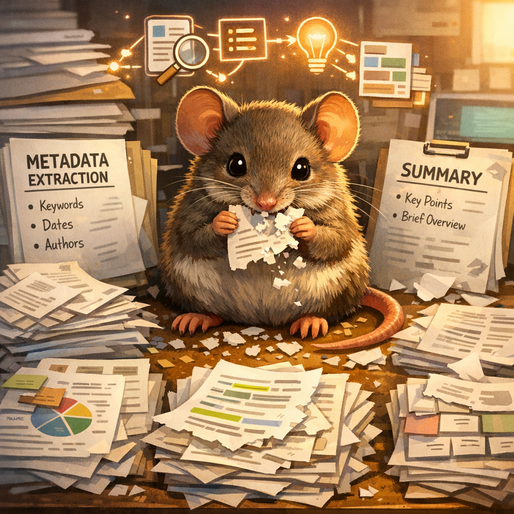
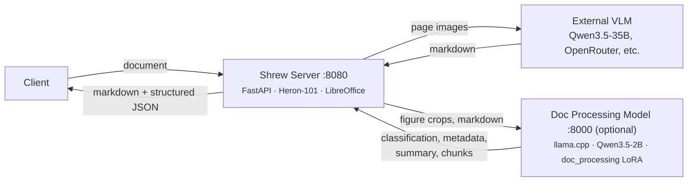

<pre align="center">
 _____ _                           _____
/  ___| |                         /  ___|
\ `--.| |__  _ __ _____      __  \ `--.  ___ _ ____   _____ _ __
 `--. \ '_ \| '__/ _ \ \ /\ / /   `--. \/ _ \ '__\ \ / / _ \ '__|
/\__/ / | | | | |  __/\ V  V /   /\__/ /  __/ |   \ V /  __/ |
\____/|_| |_|_|  \___| \_/\_/    \____/ \___|_|    \_/ \___|_|
</pre>

<p align="center">
  
</p>

<p align="center">
  <strong>Document to clean markdown using Vision Language Models</strong><br>
  PDF, images, and office docs &rarr; structured markdown + metadata + semantic chunks
</p>

Shrew renders each page of a document as an image and sends it to a VLM for transcription. It produces clean markdown with LaTeX math, tables, figures, and document structure. Optionally, it extracts structured JSON: metadata, a summary, and semantic chunks for RAG.

Supports **PDF**, **images** (PNG, JPG, TIFF, BMP, WebP, GIF), and **office documents** (DOCX, PPTX, DOC, PPT, ODT, ODP).

Prompts and generation parameters are tuned for **Qwen 3.5**. Other VLMs may work but are not tested.

## Architecture

Shrew has two components:



- **External VLM** (required) — A large VLM like Qwen3.5-35B for page transcription. You provide this (vLLM, llama.cpp, OpenRouter, etc.).
- **Doc Processing Model** (optional) — A small Qwen3.5-2B with a fine-tuned `doc_processing` LoRA adapter for structured extraction (metadata, summary, chunking). Runs locally via llama.cpp. If not available, the main VLM handles extraction instead. *Note: semantic chunking is currently in beta.*

## Quick start

### Bare metal

```bash
pip install .[server,figures]

VLM_URL=http://localhost:8000 VLM_MODEL=Qwen/Qwen3.5-35B shrew serve

# Convert a document
curl -X POST localhost:8080/v1/convert -F file=@doc.pdf
```

**Install extras:**

| Extra | What it adds | Without it |
|-------|-------------|------------|
| `server` | FastAPI HTTP server (`shrew serve`) | CLI-only (`shrew convert`) |
| `figures` | Figure detection via heron-101 layout model (pulls PyTorch) | No figure crops or captions |

`pip install .` gives you just the CLI with no figure detection. `pip install .[server,figures]` is the full install.

### Docker

```bash
cd docker
cp .env.example .env
# Edit .env — set VLM_URL and VLM_MODEL

# Server only (connects to your external VLM)
docker compose -f docker-compose.yml up -d --build

# Server + Doc Processing model on NVIDIA GPU
docker compose -f docker-compose.yml -f docker-compose.cuda.yml up -d --build

# View logs
docker compose -f docker-compose.yml -f docker-compose.cuda.yml logs -f
```

Other GPU variants: replace `docker-compose.cuda.yml` with `docker-compose.rocm.yml` (AMD) or `docker-compose.vulkan.yml` (Vulkan).

## Docker deployment

### Container variants

| Variant | Dockerfile | Base image | Purpose |
|---------|-----------|------------|---------|
| **server** | `Dockerfile.server` | `python:3.12-slim` | Shrew API + figure detection + LibreOffice |
| **cuda** | `Dockerfile.cuda` | `ghcr.io/ggml-org/llama.cpp:server-cuda` | Doc Processing model on NVIDIA GPU |
| **rocm** | `Dockerfile.rocm` | `ghcr.io/ggml-org/llama.cpp:server-rocm` | Doc Processing model on AMD GPU |
| **vulkan** | `Dockerfile.vulkan` | `ghcr.io/ggml-org/llama.cpp:server-vulkan` | Doc Processing model on any Vulkan GPU |

The **server** container always runs. Pick one GPU variant for the Doc Processing model, or skip it to use your main VLM for everything.

### Running with Docker Compose

```bash
# Copy environment template
cp docker/.env.example docker/.env

# Server only — no local Doc Processing model, main VLM handles everything
docker compose -f docker/docker-compose.yml up server

# NVIDIA GPU
docker compose -f docker/docker-compose.yml -f docker/docker-compose.cuda.yml up

# AMD GPU (ROCm)
docker compose -f docker/docker-compose.yml -f docker/docker-compose.rocm.yml up

# Any GPU (Vulkan — NVIDIA, AMD, Intel Arc)
docker compose -f docker/docker-compose.yml -f docker/docker-compose.vulkan.yml up
```

### Running without Compose

```bash
# Build and run server only
docker build -f docker/Dockerfile.server -t shrew-server .
docker run -p 8080:8080 \
  -e VLM_URL=http://host.docker.internal:8000 \
  -e VLM_MODEL=Qwen/Qwen3.5-35B \
  shrew-server

# Build and run Doc Processing model separately (CUDA example)
docker build -f docker/Dockerfile.cuda -t doc-processing .
docker run -p 8000:8000 --gpus all doc-processing
```

### Environment variables

Configure in `docker/.env` or pass with `-e`:

| Variable | Description | Default |
|----------|-------------|---------|
| `VLM_URL` | URL of your main VLM for page transcription | `http://localhost:8000` |
| `VLM_MODEL` | Model name at VLM_URL (auto-detected if not set) | — |
| `VLM_API_KEY` | API key for VLM endpoint (needed for OpenRouter) | — |
| `VLM_CONCURRENCY` | Max concurrent VLM calls across all workers (cross-process gate) | `4` |
| `PIPELINE_CONCURRENCY` | Max concurrent document pipelines | `3` |
| `SHREW_VLLM_URL` | URL of Doc Processing model (set automatically by compose) | — |
| `SHREW_ASYNC_STAGE3` | Run extraction tasks in parallel (set automatically by compose) | — |
| `VLM_TIMEOUT_MARGIN` | Multiplier for adaptive timeout threshold (e.g. `1.5` = 50% above observed max) | `1.5` |
| `SECTION_MAX_TOKENS` | Max tokens per section for semantic chunking | `9000` |
| `DOCLING_DEVICE` | Figure detection accelerator: `auto`, `cpu`, `cuda` | `auto` |
| `SHREW_HOST` | Server bind address | `0.0.0.0` |
| `SHREW_PORT` | Server bind port | `8080` |
| `SHREW_WORKERS` | Uvicorn worker count | `1` |
| `LOG_LEVEL` | Logging level: `DEBUG`, `INFO`, `WARNING`, `ERROR` | `INFO` |

**Using OpenRouter** instead of a local VLM:
```bash
VLM_URL=https://openrouter.ai/api
VLM_MODEL=qwen/qwen3.5-35b-a3b
VLM_API_KEY=sk-or-...
```

### Hardware tuning

Parameters you can adjust in the Dockerfiles for your hardware:

**Server container** (`Dockerfile.server`):
- `VLM_CONCURRENCY` — Max concurrent VLM calls across all workers. This is a cross-process semaphore: even with multiple uvicorn workers (`SHREW_WORKERS`), the total in-flight VLM requests never exceeds this number. Higher = faster but more VRAM pressure on your VLM server. Default `4`, increase to `8-20` if your VLM has headroom.
- `PIPELINE_CONCURRENCY` — How many documents process simultaneously per worker. All pipelines share the global `VLM_CONCURRENCY` gate, so this controls how many documents compete for VLM slots. Default `3`.
- `VLM_TIMEOUT_MARGIN` — Multiplier for the adaptive timeout. Shrew tracks per-page VLM response times and flags pages that exceed `max_observed * margin` as outliers for retry. Default `1.5` (50% above max). Increase if your VLM has high latency variance under load.

**Doc Processing model container** (`Dockerfile.cuda` / `Dockerfile.rocm` / `Dockerfile.vulkan`):
- `--ctx-size 100000` — Total context window shared across all parallel slots. llama.cpp pre-allocates KV cache at startup (unlike vLLM which allocates on demand), so this is divided evenly: `--parallel 4` gives 25000 tokens per slot. The Doc Processing model needs ~9000 tokens for semantic chunking, so 25k per slot is sufficient.
- `--parallel 4` — Concurrent request slots in llama.cpp. Each slot gets `ctx-size / parallel` tokens. Reduce if you're tight on VRAM.
- Base model quantization — The default `Q8_K_XL` (~2.5 GB) is high quality. For smaller VRAM, swap the `ADD` URL for a Q4 quantization from [unsloth/Qwen3.5-2B-GGUF](https://huggingface.co/unsloth/Qwen3.5-2B-GGUF).

**Rough VRAM requirements for the Doc Processing model container:**

| Config | VRAM |
|--------|------|
| `--parallel 1 --ctx-size 25000` (minimal) | ~4 GB |
| `--parallel 4 --ctx-size 100000` (default) | ~7 GB |
| `--parallel 8 --ctx-size 200000` (high throughput) | ~12 GB |

## API

### `POST /v1/convert`

Convert a document to markdown + structured JSON.

**Request** (multipart form):

| Field | Type | Default | Description |
|-------|------|---------|-------------|
| `file` | file | required | PDF, image, or office document |
| `model` | string | server default | VLM model name override |
| `pages` | string | all | Page range, e.g. `1-5` or `3` |
| `skip_stage3` | bool | `false` | Skip structured extraction (metadata/summary/chunking) |
| `high_dpi` | int | `200` | DPI for page images sent to VLM |

**Response** (JSON):
```json
{
  "markdown": "# Document Title\n\n...",
  "metadata": {
    "title": "...",
    "authors": ["..."],
    "year": 2024,
    "type": "research_paper",
    "keywords": ["..."]
  },
  "summary": "...",
  "semantic_chunks": [
    {"chunk_id": "1", "content": "...", "type": "introduction"}
  ],
  "images": [
    {"index": 0, "data": "<base64>", "format": "png", "caption": "...", "page": 3}
  ],
  "processing_log": {
    "total_pages": 12,
    "total_figures": 4,
    "total_time_seconds": 45.2
  }
}
```

**v2 structured pipeline (default):** `/v1/convert` and `/v1/convert/stream` now route through the v2 single-model structured pipeline by default (`pipeline_mode=structured`). One structured-extraction VLM (`VLM_MODEL`, e.g. `shrew-9b`) is called once per page and returns metadata/summary/semantic_chunks/figures/tables directly — no separate Doc Processing model or docling stage is required. The response shape above still holds, plus a new `tables` key (cropped table images alongside `html`/`flat_text` transcriptions); `images` are now figure crops taken from the hires page render rather than VLM-described images; and each `semantic_chunks` entry carries page provenance (which page(s) it was assembled from) so chunks can be traced back to source pages. The legacy multi-stage pipeline (VLM transcription + docling + editor) is still available by passing `pipeline_mode=vlm` or `pipeline_mode=conventional`.

### `POST /v1/convert/stream`

Same as `/v1/convert` but returns Server-Sent Events with progress updates:

```
event: progress
data: {"percent": 25, "message": "Transcribing pages (3/12)..."}

event: progress
data: {"percent": 70, "message": "Extracting metadata..."}

event: complete
data: {"percent": 100, "result": { ... full response ... }}
```

### `GET /health`

Returns `{"status": "ok"}` when all VLM backends are reachable. Returns `503` with details when a backend is down:
```json
{"status": "unhealthy", "unavailable": ["vlm"]}
```

Both `/v1/convert` and `/v1/convert/stream` also run a pre-flight VLM health check and return `503` if the VLM is unreachable.

## CLI

```bash
pip install .

# Basic conversion
shrew convert doc.pdf -o output/ --vlm-model Qwen/Qwen3.5-35B

# OpenRouter
shrew convert doc.pdf -o output/ \
  --vlm-url https://openrouter.ai/api \
  --vlm-model qwen/qwen3.5-35b-a3b \
  --api-key sk-or-...

# Image input
shrew convert scan.png -o output/ --vlm-model Qwen/Qwen3.5-35B

# Multi-page TIFF
shrew convert scan.tiff -o output/ --vlm-model Qwen/Qwen3.5-35B

# Specific pages, skip structured extraction
shrew convert doc.pdf -o output/ --vlm-model Qwen/Qwen3.5-35B --skip-stage3 --pages 1-5

# With Doc Processing model for structured extraction
shrew convert doc.pdf -o output/ --vlm-model Qwen/Qwen3.5-35B \
  --shrew-vllm-url http://localhost:8000 --async-stage3
```

## Output

```
output/
├── clean.md                  # Final markdown with <page N> tags
├── dirty.md                  # Raw VLM transcription
├── processing_log.json       # Timing and config
├── structured.json           # Metadata, summary, chunks, images (unless --skip-stage3 flag)
├── figures/                  # Extracted figure crops
│   └── figure_page3_0.png
└── pages/
    ├── page_0001_hires.png   # 200 DPI (sent to VLM)
    ├── page_0001_display.png # 100 DPI (figure detection)
    ├── page_0001_dirty.md    # Per-page raw output
    └── page_0001_clean.md    # Per-page final output
```

## Supported file types

| Format | Extension | Notes |
|--------|-----------|-------|
| PDF | `.pdf` | Native rasterization via pypdfium2 |
| PNG | `.png` | Single page |
| JPEG | `.jpg`, `.jpeg` | Single page |
| TIFF | `.tiff`, `.tif` | Multi-page supported (one page per frame) |
| BMP | `.bmp` | Single page |
| WebP | `.webp` | Single page |
| GIF | `.gif` | First frame only |
| Word | `.docx`, `.doc` | Converted to PDF via LibreOffice |
| PowerPoint | `.pptx`, `.ppt` | One slide per page |
| OpenDocument text/presentation | `.odt`, `.odp` | Converted to PDF via LibreOffice |
| Excel / OpenDocument spreadsheet | `.xlsx`, `.xlsm`, `.xls`, `.ods` | Extracted deterministically via openpyxl (per-sheet markdown tables + chart metadata); no transcription; semantic chunking skipped |
| CSV | `.csv` | Rendered directly as a markdown table; no transcription; semantic chunking skipped |
| Plain text | `.txt` | Read directly; no transcription |
| Markdown | `.md` | Read directly; no transcription |
| RTF | `.rtf` | Converted to plain text via LibreOffice; no transcription |
| HTML | `.html`, `.htm` | Parsed with BeautifulSoup (scripts/styles stripped), converted to markdown; no transcription |

## License

MIT
