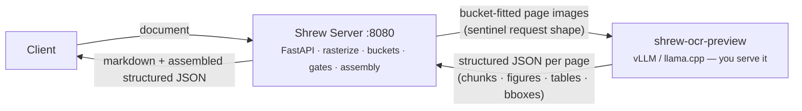

<pre align="center">
 _____ _                           _____
/  ___| |                         /  ___|
\ `--.| |__  _ __ _____      __  \ `--.  ___ _ ____   _____ _ __
 `--. \ '_ \| '__/ _ \ \ /\ / /   `--. \/ _ \ '__\ \ / / _ \ '__|
/\__/ / | | | | |  __/\ V  V /   /\__/ /  __/ |   \ V /  __/ |
\____/|_| |_|_|  \___| \_/\_/    \____/ \___|_|    \_/ \___|_|
</pre>

<p align="center">
  
</p>

<p align="center">
  <strong>Document to clean markdown using Vision Language Models</strong><br>
  PDF, images, and office docs &rarr; structured markdown + metadata + semantic chunks
</p>

Shrew renders each page of a document as an image and sends it to a VLM for transcription. It produces clean markdown with LaTeX math, tables, figures, and document structure. Optionally, it extracts structured JSON: metadata, a summary, and semantic chunks for RAG.

Supports **PDF**, **images** (PNG, JPG, TIFF, BMP, WebP, GIF), and **office documents** (DOCX, PPTX, DOC, PPT, ODT, ODP).

## Using with shrew-ocr-preview (recommended)

The default structured pipeline is built for
[**shrew-ocr-preview**](https://huggingface.co/btbtyler09/shrew-ocr-preview) —
our per-page document-understanding model — and implements its **entire input
contract server-side**: glyph-routed bucket preprocessing, the
`structured_extraction` sentinel request shape, greedy-plus-presence-penalty
decoding, the streaming repetition guard, schema gates with coercion checks,
and multi-page assembly. You do not hand-build any of the model card's
preprocessing — point the server at a vLLM endpoint serving the model and POST
documents:

```bash
# 1. Serve the model (bf16 or the GPTQ-8bit variant) with vLLM per its model card
vllm serve btbtyler09/shrew-ocr-preview --trust-remote-code \
  --served-model-name shrew-ocr-preview \
  --max-model-len 32768 --limit-mm-per-prompt '{"image":1}' --no-enable-prefix-caching

# 2. Run shrew-server against it
VLM_URL=http://localhost:8000 VLM_MODEL=shrew-ocr-preview shrew serve

# 3. Convert
curl -X POST localhost:8080/v1/convert -F file=@doc.pdf -F pipeline_mode=structured

# Or get the structured markdown directly (text/markdown response)
curl -X POST localhost:8080/v1/convert -F file=@doc.pdf -F format=markdown
```

No vLLM? A fully self-contained stack (llama.cpp serving the
[Q8_0 GGUF](https://huggingface.co/btbtyler09/shrew-ocr-preview-GGUF) +
shrew-server) runs on a single ≥12 GB NVIDIA GPU:

```bash
cd docker
docker compose -f docker-compose.yml -f docker-compose.ocr.yml up -d --build
curl -X POST localhost:8080/v1/convert -F file=@doc.pdf
```

Both the bf16 and GPTQ-8bit model variants work unchanged (the server is
endpoint-agnostic; follow the model card's serving flags for the variant you
run). The legacy multi-stage pipeline below (tuned for **Qwen 3.5**) remains
available via `pipeline_mode=vlm`.

## Architecture

The default (structured) pipeline is two pieces — this server and one model:



The server owns everything around the model: rasterization, glyph-routed
bucket preprocessing, the request contract, tuned decoding with a
schema-enforced retry tier, the streaming repetition guard, schema/coercion
gates, multi-page assembly (chunk provenance, cross-page table continuation),
and figure/table cropping from the hires renders. One model call per page.

A **legacy multi-stage pipeline** (any transcription VLM such as Qwen 3.5 +
an optional small Doc Processing model with a LoRA adapter, plus the heron-101
figure detector) remains available via `pipeline_mode=vlm` /
`pipeline_mode=conventional`; the legacy Docker variants below serve it.

## Quick start

### Bare metal

```bash
pip install .[server,figures]

# Point at your endpoint serving shrew-ocr-preview (see quickstart above)
VLM_URL=http://localhost:8000 VLM_MODEL=shrew-ocr-preview shrew serve

# Convert a document
curl -X POST localhost:8080/v1/convert -F file=@doc.pdf
```

**Install extras:**

| Extra | What it adds | Without it |
|-------|-------------|------------|
| `server` | FastAPI HTTP server (`shrew serve`) | CLI-only (`shrew convert`) |
| `figures` | Figure detection via heron-101 layout model (pulls PyTorch) — **legacy pipeline only**; the structured pipeline gets figure/table crops from the model's own bboxes and does not need this | No figure crops in legacy mode |

`pip install .` gives you just the CLI with no figure detection. `pip install .[server,figures]` is the full install.

### Docker

```bash
cd docker
cp .env.example .env
# Edit .env — set VLM_URL and VLM_MODEL

# Server only (connects to your external VLM)
docker compose -f docker-compose.yml up -d --build

# Server + Doc Processing model on NVIDIA GPU
docker compose -f docker-compose.yml -f docker-compose.cuda.yml up -d --build

# View logs
docker compose -f docker-compose.yml -f docker-compose.cuda.yml logs -f
```

Other GPU variants: replace `docker-compose.cuda.yml` with `docker-compose.rocm.yml` (AMD) or `docker-compose.vulkan.yml` (Vulkan).

## Docker deployment

### Container variants

| Variant | Dockerfile | Base image | Purpose |
|---------|-----------|------------|---------|
| **server** | `Dockerfile.server` | `python:3.12-slim` | Shrew API + figure detection + LibreOffice |
| **ocr-cuda** | `Dockerfile.ocr-cuda` | `ghcr.io/ggml-org/llama.cpp:server-cuda` | **shrew-ocr-preview Q8_0** (structured pipeline) on NVIDIA GPU |
| **cuda** | `Dockerfile.cuda` | `ghcr.io/ggml-org/llama.cpp:server-cuda` | Legacy Doc Processing model on NVIDIA GPU |
| **rocm** | `Dockerfile.rocm` | `ghcr.io/ggml-org/llama.cpp:server-rocm` | Legacy Doc Processing model on AMD GPU |
| **vulkan** | `Dockerfile.vulkan` | `ghcr.io/ggml-org/llama.cpp:server-vulkan` | Legacy Doc Processing model on any Vulkan GPU |

The **server** container always runs. For the default structured pipeline,
pair it with **ocr-cuda** (`docker-compose.ocr.yml`, see Quick start) or an
external vLLM endpoint serving shrew-ocr-preview. The cuda/rocm/vulkan
variants belong to the legacy pipeline.

### Running with Docker Compose

```bash
# Copy environment template
cp docker/.env.example docker/.env

# Server only — no local Doc Processing model, main VLM handles everything
docker compose -f docker/docker-compose.yml up server

# NVIDIA GPU
docker compose -f docker/docker-compose.yml -f docker/docker-compose.cuda.yml up

# AMD GPU (ROCm)
docker compose -f docker/docker-compose.yml -f docker/docker-compose.rocm.yml up

# Any GPU (Vulkan — NVIDIA, AMD, Intel Arc)
docker compose -f docker/docker-compose.yml -f docker/docker-compose.vulkan.yml up
```

### Running without Compose

```bash
# Build and run server only
docker build -f docker/Dockerfile.server -t shrew-server .
docker run -p 8080:8080 \
  -e VLM_URL=http://host.docker.internal:8000 \
  -e VLM_MODEL=shrew-ocr-preview \
  shrew-server

# Build and run Doc Processing model separately (CUDA example)
docker build -f docker/Dockerfile.cuda -t doc-processing .
docker run -p 8000:8000 --gpus all doc-processing
```

### Environment variables

Configure in `docker/.env` or pass with `-e`:

| Variable | Description | Default |
|----------|-------------|---------|
| `VLM_URL` | URL of your main VLM for page transcription | `http://localhost:8000` |
| `VLM_MODEL` | Model name at VLM_URL (auto-detected if not set) | — |
| `VLM_API_KEY` | API key for VLM endpoint (needed for OpenRouter) | — |
| `VLM_CONCURRENCY` | Max in-flight VLM calls **across all uvicorn workers combined** (cross-process flock gate) | `4` |
| `PIPELINE_CONCURRENCY` | Max concurrent document pipelines **per uvicorn worker** (one gate shared by `/v1/convert` and `/v1/convert/stream`) | `3` |
| `SHREW_VLLM_URL` | URL of Doc Processing model (set automatically by compose) | — |
| `SHREW_ASYNC_STAGE3` | Run extraction tasks in parallel (set automatically by compose) | — |
| `VLM_TIMEOUT_MARGIN` | Multiplier for adaptive timeout threshold (e.g. `1.5` = 50% above observed max) | `1.5` |
| `SECTION_MAX_TOKENS` | Max tokens per section for semantic chunking | `9000` |
| `DOCLING_DEVICE` | Figure detection accelerator: `auto`, `cpu`, `cuda` | `auto` |
| `SHREW_HOST` | Server bind address | `0.0.0.0` |
| `SHREW_PORT` | Server bind port | `8080` |
| `SHREW_WORKERS` | Uvicorn worker count | `1` |
| `LOG_LEVEL` | Logging level: `DEBUG`, `INFO`, `WARNING`, `ERROR` | `INFO` |

**Using OpenRouter** instead of a local VLM:
```bash
VLM_URL=https://openrouter.ai/api
VLM_MODEL=qwen/qwen3.5-35b-a3b
VLM_API_KEY=sk-or-...
```

### Hardware tuning

Parameters you can adjust in the Dockerfiles for your hardware:

**Server container** (`Dockerfile.server`):
- `VLM_CONCURRENCY` — Max in-flight VLM calls **across all uvicorn workers combined**. The model server has a fixed number of serving slots, so this is a machine-wide gate (crash-safe flock slot files under `SHREW_CONCURRENCY_DIR`) — `SHREW_WORKERS` does **not** multiply it. Size it to your VLM server's slot count. Default `4`. (Before v0.3.8 the gate was accidentally per-worker: real load was `SHREW_WORKERS ×` the configured value.)
- `PIPELINE_CONCURRENCY` — How many documents process simultaneously **per uvicorn worker**; effective capacity is `SHREW_WORKERS × PIPELINE_CONCURRENCY`. One gate covers both `/v1/convert` and `/v1/convert/stream` (they never had separate capacity from v0.3.7 on). Default `3`. `/health`'s `concurrency` section reports both the per-worker and effective limits plus live running/queued conversion counts.
- `VLM_TIMEOUT_MARGIN` — Multiplier for the adaptive timeout. Shrew tracks per-page VLM response times and flags pages that exceed `max_observed * margin` as outliers for retry. Default `1.5` (50% above max). Increase if your VLM has high latency variance under load.

**Doc Processing model container** (`Dockerfile.cuda` / `Dockerfile.rocm` / `Dockerfile.vulkan`):
- `--ctx-size 100000` — Total context window shared across all parallel slots. llama.cpp pre-allocates KV cache at startup (unlike vLLM which allocates on demand), so this is divided evenly: `--parallel 4` gives 25000 tokens per slot. The Doc Processing model needs ~9000 tokens for semantic chunking, so 25k per slot is sufficient.
- `--parallel 4` — Concurrent request slots in llama.cpp. Each slot gets `ctx-size / parallel` tokens. Reduce if you're tight on VRAM.
- Base model quantization — The default `Q8_K_XL` (~2.5 GB) is high quality. For smaller VRAM, swap the `ADD` URL for a Q4 quantization from [unsloth/Qwen3.5-2B-GGUF](https://huggingface.co/unsloth/Qwen3.5-2B-GGUF).

**Rough VRAM requirements for the Doc Processing model container:**

| Config | VRAM |
|--------|------|
| `--parallel 1 --ctx-size 25000` (minimal) | ~4 GB |
| `--parallel 4 --ctx-size 100000` (default) | ~7 GB |
| `--parallel 8 --ctx-size 200000` (high throughput) | ~12 GB |

## API

### `POST /v1/convert`

Convert a document to markdown + structured JSON.

**Request** (multipart form):

| Field | Type | Default | Description |
|-------|------|---------|-------------|
| `file` | file | required | PDF, image, or office document |
| `model` | string | server default | VLM model name override |
| `pages` | string | all | Page range, e.g. `1-5` or `3`. Bounds work for every input type: PDF/image pages, and paginated text/CSV/spreadsheet blocks. Page numbers keep their original (1-indexed, whole-document) values; `source_pages`/`processing_log.total_pages` always report the full document, not the size of the requested slice. A range past the end is clamped; one starting past the end processes nothing. |
| `format` | str | `json` | `json` (full response) or `markdown` (text/markdown body of the structured markdown only) |
| `skip_extraction` | bool | `false` | Skip structured extraction (metadata/summary/chunking). `skip_stage3` is a deprecated alias. |
| `high_dpi` | int | `200` | DPI for page images sent to VLM |

**Response** (JSON, structured pipeline — the default):
```json
{
  "markdown": "<page 1>\n# Document Title\n\n...",
  "metadata": {
    "title": "...", "authors": ["..."], "organization": "...",
    "year": 2024, "doc_type": "research_paper",
    "type": "pdf", "id": "...", "file_path": "...",
    "source_pages": 12, "num_chunks": 34
  },
  "summary": "Document-level summary assembled from per-page summaries.",
  "semantic_chunks": [
    {
      "chunk_id": "p1_c1",
      "title": "Abstract and Introduction Overview",
      "content": "...",
      "section_type": "abstract",
      "keywords": ["..."],
      "page": 1, "pages": [1]
    }
  ],
  "tables": [
    {
      "table_id": "t1", "page": 3, "pages": [3],
      "continues": null, "continued_by": null,
      "bbox": [481.2, 680.0, 810.0, 815.0],
      "caption": "...", "html": "<table>...</table>",
      "flat_text": "...", "format": "png", "data": "<base64 table crop>"
    }
  ],
  "images": [
    {
      "index": 0, "data": "<base64 figure crop>", "format": "png",
      "caption": "...", "page": 2, "bbox": [557.1, 155.0, 830.0, 300.0]
    }
  ],
  "processing_log": {
    "total_pages": 12, "total_figures": 4, "total_time_seconds": 45.2,
    "modality": "image",
    "failed_pages": 0,
    "gates": {
      "pages": 12, "first_pass_ok": 11, "schema_coerced": 1,
      "degenerate": 0, "repetition_aborted": 0, "wall_clock_aborts": 0,
      "coerced_empty": 0, "fallback_pages": 0,
      "buckets": {"B1": 8, "B2": 4}
    },
    "fidelity": {
      "flagged": [
        {"token": "DCRrectifierControl_PH", "closest": "DCRectifierControl_PH",
         "distance": 1, "where": "doc_summary", "count": 1,
         "class": "ident", "ambiguous": false, "corrected": true}
      ],
      "vocab_size": 412, "checked": 38, "corrected": 1
    }
  }
}
```

Notes on the shape:
- `section_type` is one of the model's trained categories (`abstract`,
  `introduction`, `methodology`, `results`, `discussion`, `conclusion`,
  `technical_content`, `appendix`).
- Bounding boxes are `[x0, y0, x1, y1]` on a 0–1000 grid normalized to the
  page image. `images` are figure crops cut from the hires page render using
  those boxes; `tables` carry both the crop and the model's `html` /
  `flat_text` transcriptions, with `continues`/`continued_by` linking
  cross-page table fragments.
- Chunks carry page provenance (`page`/`pages`) so every chunk traces back to
  its source page(s).
- `processing_log.gates` reports the serving-gate outcomes per document
  (first-pass successes, schema coercions, repetition/degeneration aborts,
  bucket routing counts). A page that fails every tier is counted in
  `failed_pages` and omitted from content — never silently filled.
- `processing_log.fidelity` (born-digital PDFs and office docs only) is a
  cross-check of the model output against the source's deterministic text
  layer. `flagged` lists precision tokens — identifiers, acronyms, standard
  references, part codes, section/version numbers — that appear in the output
  but are not backed by the source, each with the closest source spelling when
  one is near (`closest`/`distance`) and the output field it appeared in
  (`where`). VLMs can corrupt such strings when *composing* summaries or
  paraphrases (transcription is far more reliable), so downstream consumers
  should treat flagged tokens as unverified rather than quoting them as
  document fact. Flagged tokens with a **unique** source match are
  deterministically corrected in the shipped output (markdown, chunks,
  tables, captions) and marked `"corrected": true` — the source is ground
  truth for its own precision strings. Corrected classes: identifiers
  (`DCRrectifierControl_PH`→`DCRectifierControl_PH`, truncations, case-only
  mangling like `DCRECTIFIERCONTROL_PH`) and structured codes — versions,
  hex addresses, part codes, standard refs (`v2.4.3`→`v2.14.3`,
  `IEC-61850-7-5`→`-7-4`). Never rewritten: **bare numeric values** (`22.4`
  near `22.5` might be legitimately different — changing a number is the one
  unforgivable failure), **pure acronyms** (source says `HTTP`, model says
  `HTTPS` — possibly correct added knowledge), and any token with an
  ambiguous (tied) match. Absent for scanned PDFs and image uploads (no
  deterministic source — unavailable, not "all clear").
  `SHREW_FIDELITY_CORRECT=0` keeps flags but disables correction;
  `SHREW_FIDELITY=0` disables the whole layer.

The **legacy multi-stage pipeline** (`pipeline_mode=vlm` or `conventional`)
returns the pre-v2 shape without `tables`, bboxes, or `gates`.

### `POST /v1/convert/stream`

Same as `/v1/convert` but returns Server-Sent Events with progress updates:

```
event: progress
data: {"percent": 25, "message": "Transcribing pages (3/12)..."}

event: progress
data: {"percent": 70, "message": "Extracting metadata..."}

event: complete
data: {"percent": 100, "result": { ... full response ... }}
```

### `GET /health`

Returns `{"status": "ok"}` when all VLM backends are reachable. Returns `503` with details when a backend is down:
```json
{"status": "unhealthy", "unavailable": ["vlm"]}
```

Both `/v1/convert` and `/v1/convert/stream` also run a pre-flight VLM health check and return `503` if the VLM is unreachable.

Every `/health` response — healthy, degraded, or unhealthy — carries a
`concurrency` section reporting configured capacity and live conversion
activity aggregated across all uvicorn workers:

```json
{
  "concurrency": {
    "workers": 2,
    "pipeline": {"per_worker_limit": 3, "effective_limit": 6},
    "vlm": {"limit": 4, "cross_process": true, "in_flight": 2},
    "conversions": {"running": 2, "queued": 1}
  }
}
```

A conversion counts as `queued` from admission until it acquires its worker's
pipeline gate, and `running` until it completes, fails, is cancelled, or the
client disconnects. Counts are tracked in a crash-safe lease directory
(`SHREW_CONCURRENCY_DIR`, default `<tmpdir>/shrew-concurrency`, `0700`) —
a worker that dies drops its flock, and its leases are pruned rather than
counted, so no stale count survives a crash or restart. `vlm.in_flight` is
the live machine-wide count of VLM calls holding a slot of the cross-process
`VLM_CONCURRENCY` gate. Reading `/health` never triggers model inference.

## CLI

The `shrew convert` CLI runs the **legacy multi-stage pipeline** (hence the
Qwen examples below) — the structured shrew-ocr-preview pipeline is served
via `shrew serve` / the API above. `--markdown` prints the assembled markdown
to stdout.

```bash
pip install .

# Basic conversion
shrew convert doc.pdf -o output/ --vlm-model Qwen/Qwen3.5-35B

# OpenRouter
shrew convert doc.pdf -o output/ \
  --vlm-url https://openrouter.ai/api \
  --vlm-model qwen/qwen3.5-35b-a3b \
  --api-key sk-or-...

# Image input
shrew convert scan.png -o output/ --vlm-model Qwen/Qwen3.5-35B

# Multi-page TIFF
shrew convert scan.tiff -o output/ --vlm-model Qwen/Qwen3.5-35B

# Specific pages, skip structured extraction
shrew convert doc.pdf -o output/ --vlm-model Qwen/Qwen3.5-35B --skip-extraction --pages 1-5

# With Doc Processing model for structured extraction
shrew convert doc.pdf -o output/ --vlm-model Qwen/Qwen3.5-35B \
  --shrew-vllm-url http://localhost:8000 --async-extraction
```

## Output

CLI (legacy pipeline) output directory layout — API users get the JSON
response documented above instead:

```
output/
├── clean.md                  # Final markdown with <page N> tags
├── dirty.md                  # Raw VLM transcription
├── processing_log.json       # Timing and config
├── structured.json           # Metadata, summary, chunks, images (unless --skip-extraction flag)
├── figures/                  # Extracted figure crops
│   └── figure_page3_0.png
└── pages/
    ├── page_0001_hires.png   # 200 DPI (sent to VLM)
    ├── page_0001_display.png # 100 DPI (figure detection)
    ├── page_0001_dirty.md    # Per-page raw output
    └── page_0001_clean.md    # Per-page final output
```

## Supported file types

| Format | Extension | Notes |
|--------|-----------|-------|
| PDF | `.pdf` | Native rasterization via pypdfium2 |
| PNG | `.png` | Single page |
| JPEG | `.jpg`, `.jpeg` | Single page |
| TIFF | `.tiff`, `.tif` | Multi-page supported (one page per frame) |
| BMP | `.bmp` | Single page |
| WebP | `.webp` | Single page |
| GIF | `.gif` | First frame only |
| Word | `.docx`, `.doc` | Converted to PDF via LibreOffice |
| PowerPoint | `.pptx`, `.ppt` | One slide per page |
| OpenDocument text/presentation | `.odt`, `.odp` | Converted to PDF via LibreOffice |
| Excel / OpenDocument spreadsheet | `.xlsx`, `.xlsm`, `.xls`, `.ods` | Extracted deterministically via openpyxl (per-sheet markdown tables + chart metadata); no transcription; semantic chunking skipped |
| CSV | `.csv` | Rendered directly as a markdown table; no transcription; semantic chunking skipped |
| Plain text | `.txt` | Read directly; no transcription |
| Markdown | `.md` | Read directly; no transcription |
| RTF | `.rtf` | Converted to plain text via LibreOffice; no transcription |
| HTML | `.html`, `.htm` | Parsed with BeautifulSoup (scripts/styles stripped), converted to markdown; no transcription |

## License

MIT
